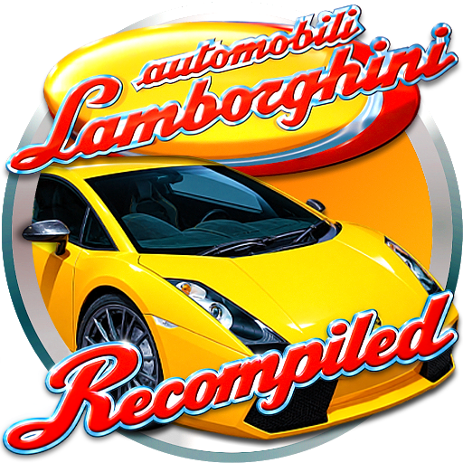

# Automobili Lamborghini: Recompiled

Automobili Lamborghini: Recompiled is a native port of the North American
Nintendo 64 game Automobili Lamborghini. It is still in development.

## Play the release

Supported release packages are provided for Windows x64 and Linux x64:

1. Download the latest package from the
   [Releases page](https://github.com/alondero/automobililamborghini-recomp/releases/latest).
2. Extract it to a folder you control.
3. Add your own legal copy of the North American USA cartridge dump. The
   simplest path is to name it Automobili Lamborghini (USA).z64 or
   Automobili Lamborghini (USA).n64 and place it beside the game executable.
4. On Windows, start `lamborghini_modern.exe`. On Linux, start
   `./lamborghini_modern`. To add Automobili Lamborghini to the Linux
   applications menu with its icon (including native Wayland taskbars), run
   `./install_linux_launcher.sh` once and start it from the menu. If you move
   the extracted folder, run the installer again to refresh the launcher.

The project does not include the game data. Only the USA release is supported.
If the game cannot find the ROM, check its name and location first.
When both default filenames exist, the .z64 file takes priority. You can also
pass a different ROM filename as the first command-line argument. Byte order
is detected from the file contents; the original file is not changed.

An Android ARM64 build path exists. It has a file picker for importing the
ROM, but this checkout did not verify an APK or a device run. Treat Android
as experimental. See the [Android guide](docs/ANDROID.md).

## Controls

Use a controller if possible. The game opens its settings with Esc, F1, or the
controller menu button. Open Button bindings to see or change the current keyboard and
controller bindings.

Player one uses the preferred connected controller, then falls back to the
keyboard. Players two through four must be assigned in Button bindings. Bindings are
saved per controller profile.

Controls also offers optional Android gyro steering and auto-accelerate for
player one. Both default to off and activate only during races. See
[controller help](docs/controllers.md) for setup and tuning.

## Settings

The settings screen includes:

- graphics and window options;
- widescreen, frame presentation, fog, camera, and draw-distance options;
- controller profiles and player assignment;
- pedal bindings;
- driver name;
- optional texture-pack paths.

Some changes apply immediately. Graphics backend, window size, and texture
packs need a restart. The screen shows when Apply or Discard is required.

## Saves and configuration

On Windows, files are stored in:

~~~text
%LOCALAPPDATA%/LamborghiniRecomp
~~~

On Linux, files are stored in:

~~~text
$XDG_CONFIG_HOME/LamborghiniRecomp
or ~/.config/LamborghiniRecomp
~~~

The folder contains settings, controller profiles, driver information, and the
Controller Pak save. Windows logs use the same application folder. Linux logs
use `$XDG_STATE_HOME/LamborghiniRecomp` or
`~/.local/state/LamborghiniRecomp`. To keep files beside the executable, use
portable mode with the portable flag, the LAMBO_PORTABLE environment variable,
or an empty portable.txt file.

Android keeps these files in the app's private storage. Clearing app data or
uninstalling the app removes them, so export saves before doing that.

The game uses a Controller Pak for records and progress. The port can import
raw MPK/PAK files, four-controller MPK files, Mupen64Plus-Next SRM files, and
DexDrive N64 files. Drag a save onto the executable or use the import-save
option. The source file is not changed.

## Mods, texture packs and track changes

The launcher and Settings include a Mods tab for code mods and texture packs.
Code packages must target Lamborghini Recompiled. See [Modding](docs/modding.md).
The port does not ship replacement artwork.
See [Texture packs](docs/TEXTURES.md).

Track Lab can apply experimental visibility corrections to stock tracks. It
does not support general custom tracks, collision, navigation, or AI. See [Modding](docs/modding.md) and [Track Lab](docs/TRACK_LAB.md).

## Known limits

- Only the North American USA release is supported.
- Windows x64 and Linux x64 are the documented desktop release targets.
- Android is an experimental build target. No current APK or Android device
  verification is part of the support claim.
- No current macOS release or end-to-end support claim is documented.
- Mod support is experimental; port-patched functions have hook restrictions.
- The port is in progress. A problem may depend on the graphics driver,
  controller, save format, or platform.

For developer information, start at the
[documentation map](docs/README.md). The short build path is in
[BUILDING.md](BUILDING.md).

## Special thanks

Thanks to [Gary (POOTERMAN)](https://www.deviantart.com/pooterman) for creating
and sharing the fan art featured at the top of this README and used for the
Windows, Linux, and Android application icons.

## Legal

This repository does not contain the original game ROM or its assets. Code
original to this repository is released under the
[GNU General Public License v3.0](LICENSE). The dependency submodules and
their local patches keep their own licenses.
