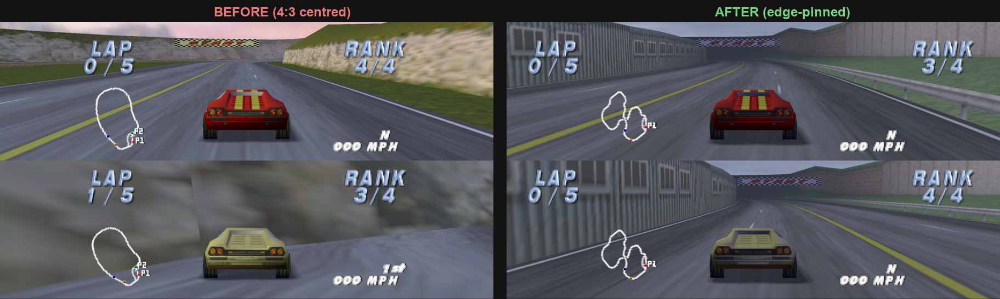
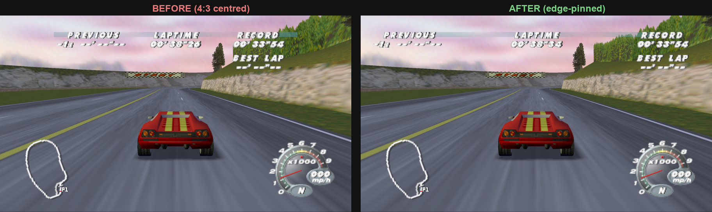
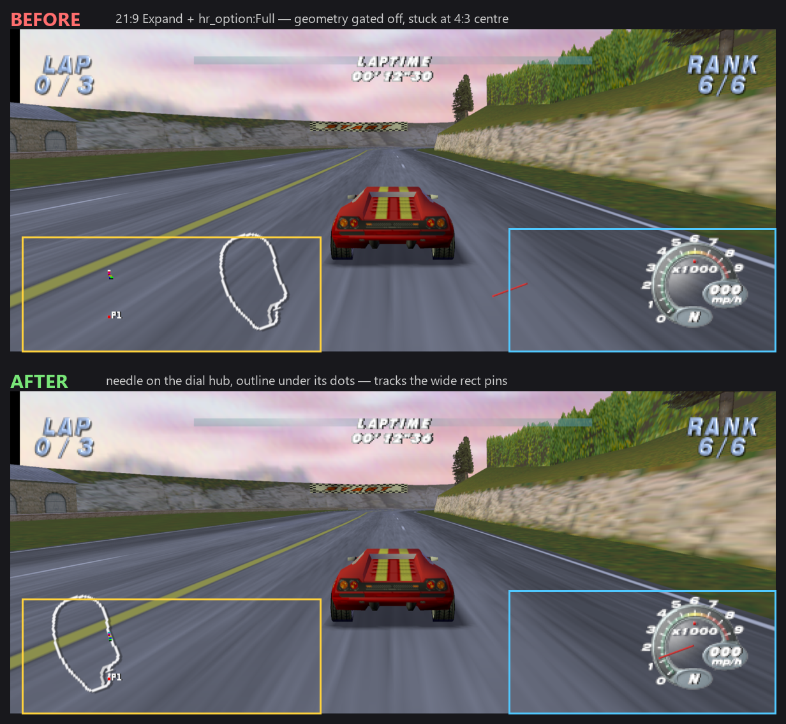

# HUD architecture & widescreen pinning (issue #2 findings, 2026-07-05)

Reference for anyone (human or LLM) touching HUD/2D rendering. Everything here was
verified live against a driven 1P race (probe printfs in the recompiled C + decoded
frame captures of the display list). Names are splat-style (`lamborghini.syms.toml`
name space); runtime vram = splat − 0xC00.

## The 2D pipeline

- **DL write cursor: `0x800A39CC`** (runtime address). Every 2D helper allocates 8
  bytes per command: load cursor, store cursor+8 back, write two words through the old
  value. Native code can inject F3DEX (v1) commands at this cursor — this is the seam
  the widescreen brackets use (`src/lambo_hud_widescreen.c`).
- **Per-frame 2D dispatcher: `func_80050860`** (runtime 0x8004FC60), called each frame
  by the game-logic state machine `func_800030F8`. It is a mode-keyed wall of inline
  draw sections: 1P race, 2P split (two variants), pause, results, etc.
- The dispatcher's helpers (all take `(a0=data, a1=x, a2=y, ...)` with x,y in 320×240
  coords): `func_8004CCB4` text/string, `func_8004D468` glyph/number,
  `func_8004DB08` digit sequence, `func_8004C070` scaled text, `func_8005464C`
  table-driven (x,y,idx) draw.

## 1P race HUD element map (all verified live)

| Element | Drawn by | Call site (jal, runtime) | Anchor |
|---|---|---|---|
| Speedo dial face + digital speed + gear | `func_80056318` (runtime 0x80055718) | `0x8004FF60`, args (0, x=0xDC, y=0x98, speed float) | right |
| RANK label+value block | `func_800583B8` (0x800577B8) | `0x8004FF88`, (val, x=0x118, y=0x13) | right |
| LAP label+values block | `func_80058464` (0x80057864) | `0x8004FFA0`, (vals, x=0x28, y=0x13); draws label at x+2, values at x−0x10/x/x+0x10 | left |
| TIME label+value | `func_8004CCB4` pair at `0x800503E8`/`0x80050414` (x=0xA0) | centered — needs no pinning |
| Speedo NEEDLE | geometry built INSIDE `func_80056318`: one `G_MTX LOAD\|MODELVIEW` (word0 `0x01020040`) + rotation MULs + static DL; pivot trans ≈ (1000, −690) model units | right (via matrix nudge, see below) |
| Minimap track outline | 3D geometry via the RACE PERSPECTIVE projection, emitted by the frame-builder tail (splat `func_8004384C` flow): camera-space `translate(-2.05, -2.4, 0)` built by the `func_80075278` jal at `0x80043C88`, then static-Mtx/tilt MULs, then polyline emitter `func_80045BDC` (runtime 0x80044FDC). The menu track maps use a different routine — `func_80044E2C` (runtime 0x8004422C, x·5−800 ortho translate), 14 call sites, all menus. | left (issue #41: hook rewrites the translate x by −1.09 camera units, verified live; env `LAMBO_WS_MINIMAP_OUTLINE_DX` overrides) |
| Minimap car dots + P1 label + player arrow | `func_80054FFC` (0x800543FC), jal `0x80050588`; a2/a3 = cos/sin of CAR HEADING (arrow rotation); dots are 2×2 texrects, arrow is 2 quads via pool `G_MTX LOAD`s whose translate is `((x−158)·10, (119−y)·10)` — exactly 10 units per game px | left (issue #41: LEFT bracket for the rects, −533-unit matrix shift for the arrow) |
| Top translucent bar | static DL `0x80167170` (one 296×6 texrect, teal prim color) via projection MTX at `0x800A2C40` | centered |
| Sun lens flare | `func_80036854` (race path, BEFORE the HUD): chain of 10 translucent "ghost" texrects (alphas 0x82–0xDD, pastel prim tints) traced from the sun's projected screen pos; loop ≈ `0x800361C0`..`0x80036A58` | tracks the sun (issue #40: `gEXSetRectAspect(STRETCH)` bracket at `0x800361BC`/`0x80036A60` → `invRatioScale=1.0`, un-squished + full-width scissor; natives in `src/lambo_flare_widescreen.c`; no-op at 4:3) |

Traps discovered the hard way:
- `func_800717E0` (0x80070BE0) is a DIAL ORCHESTRATOR for an **alternate dial style /
  other modes** — it does NOT run in a normal 1P race (the 1P path branches around it
  right after the needle/minimap call at `0x80050588`).
- `func_80054FFC` looks speed-driven (cos/sin floats) but is the MINIMAP overlay, not
  the needle. Pinning it detaches dots/arrow from the track outline.
- `func_80058C48(a0=1..5, 160, 112)` correlates with gear but is a centered element
  (draws in menus/other screens too) — not the needle.
- 2P split is TOP/BOTTOM: sections at `0x80050CE8`/`0x80050D00` (y=0x10) and
  `0x80050F2C`/`0x80050F44` (y=0x80). RANK x=0x10E, LAP x=0x28 per half —
  same left/right anchors as 1P (issue #42: now hooked, see below).

## Mode dispatch & per-mode HUD (issue #42, verified live 2026-07-06)

`func_80050860` keys on the **player count** at `0x800CE6A4` (`$s0`): `==1` → 1P
section, `==2` → 2P top/bottom (`L_80050BEC`), `==3`/`==4` → quad-split (`L_800517A8`).
Verified by probe printf + `LAMBO_WARP=circuit:laps:car:<players>` (the dev warp's
players field boots straight into any of these). The **race mode** at `0x800CE6B4`
(`==0` time trial, `==2` single race) sub-branches *within* the 1P section.

| Mode | Reach | RT64 output | HUD pinning |
|---|---|---|---|
| 1P arcade | `players=1`, `0x800CE6B4=2` | stretched wide | done (#2/#41) |
| 1P time trial | `players=1`, `0x800CE6B4=0` (`LAMBO_WARP_MODE=0`) | stretched wide | done (#42): PREVIOUS left, RECORD/BEST-LAP right; LAPTIME centred; speedo+minimap shared with 1P (already pinned) |
| 2P split | `players=2` | stretched wide (top/bottom, full width) | done (#42/#56): per half RANK right, LAP left, speed readout right, alt-dial gauge tracked by the bracket's matrix walker, **minimap pinned left** (2D per half) |
| 3P/4P | `players=3`/`4` | **pillarboxed 4:3** (dark side bars) | none needed — quad viewports don't cover the framebuffer width, so RT64 keeps them 4:3; the HUD is correct inside each 4:3 quadrant |

Before/after (widescreen output, edge-pinning off vs on):

Details verified live:
- **2P split** (`L_80050BEC`): each half reuses the 1P RANK (`func_800583B8`, x=0x10E)
  / LAP (`func_80058464`, x=0x28) helpers, so the same `pin_right`/`pin_left` brackets
  apply per call site (top `0x80050CE8`/`0x80050D00`, bottom `0x80050F2C`/`0x80050F44`).
  The per-half speed/place readout is drawn by the **alternate-dial orchestrator**
  `func_800717E0` (a0 = player index; not in a 1P race) on the RIGHT (x=0xDC) — the
  whole DIALORCH call is bracketed `pin_right` (top `0x80050E0C`, bottom `0x80051050`).
  This pins the texrect **numbers**; `func_800717E0` also builds a **gauge as geometry**
  (via `func_80075278`, the modelview-translate builder behind the 1P needle), which
  `gEXSetRectAlign` can't move — but the bracket is `pin_right`/`pin_reset`, and the reset
  runs the same **matrix walker** as the 1P needle over the whole call span, so any gauge
  `G_MTX LOAD` inside `func_800717E0` (it calls `func_8006FC68` for the dial) is shifted
  with the numbers. No separate hook needed; verified live no gauge floats centred (#56).
  The section-C tail branches to `L_800517A0`, so the 1P-style sections at
  `0x800512xx`/`0x800515xx` never run in 2P.
- **Time trial** (mode-0 branch `L_8004FFB0`, `beq` at `0x8004FF70` skips RANK/LAP):
  its top row is all texrects (`func_8004D468` glyph / `func_8005464C` table draw), so
  one rect-align bracket per side covers a whole multi-glyph cluster — left cluster
  PREVIOUS (draws `0x8004FFF8`..`0x800501D8`), right cluster RECORD+BEST-LAP (draws
  `0x800501F4`..`0x80050274`). The reset's matrix walker finds no `G_MTX LOAD` here.
- **2P minimap** (#56) is pinned LEFT per half. Unlike 1P — where the track outline is
  3D geometry through the race perspective projection (center-anchored under Expand) and
  needs a separate camera-space shift — the *2P* minimap is drawn ENTIRELY as 2D texrects
  by the overlay `func_80054FFC` (dots + P1 + player arrow + the track outline). Verified
  live: the whole composite moves together under a single LEFT rect-align bracket, and the
  1P 3D outline builder (`func_8004384C` @ `0x80043F4C`) never fires in 2P (its output is
  the dead merge sibling `func_800448DC` — nothing calls it). So each half's overlay call
  gets the same LEFT bracket as the 1P minimap (`lambo_ws_minimap_pin_2p` = `pin_left`,
  then `lambo_ws_minimap_reset` for the arrow's LOAD matrix): top `0x80050DB4`, bottom
  `0x80050FF8`. No 3D hook or camera-unit calibration, and no aspect scaling — RT64's
  `hr_option` gives the rect pins the right edge travel at every aspect (verified 4:3
  no-op, 16:9 Clamp16x9, 21:9 Full).

## Injection mechanism (no MIPS patch pipeline needed)

`[[patches.hook]]` in `lamborghini.us.toml` (`func`, `before_vram`, `text`) injects raw
C text before the instruction at `before_vram` when N64Recomp emits the function
(vendored N64Recomp `recompilation.cpp:129`). The text runs in the recompiled function
scope (`rdram`, `ctx` available; implicit declaration links against natives).
Rules:
- `before_vram` must not be a branch delay slot.
- Place hooks BEFORE the game's cursor-allocation block for the following command
  (the alloc pattern is ~5 instructions: `lw` cursor / `addiu +8` / `sw` / `sw` to
  stack), or your injected commands land after the game's next command.
- Regenerating RecompiledFuncs: `N64Recomp.exe lamborghini.us.toml` from repo root,
  then delete `build/**/libRecompiledFuncs.a` before rebuilding.

## RT64 extended-GBI facts (verified against lib/rt64 source + live)

- Enable hook: `G_SPNOOP`(0x00 on F3DEX v1) with magic `0x525464`, w1 =
  `(1<<28)|0x64`. Must be emitted before any `0x64` extended command; idempotent.
- `gEXSetRectAlign` affects ONLY rects (texrects/fillrects). LEFT pin =
  `(LEFT, LEFT, 0,0,0,0)`; RIGHT pin = `(RIGHT, RIGHT, -1280, 0, -1280, 0)`
  (offsets are quarter-pixels; −1280 re-bases the 320-wide coordinate space);
  reset = ORIGIN_NONE (0x800). At 4:3 output the math degenerates — no gating needed.
- The game's own scissor is untagged, so RT64 centers it on 4:3 and CROPS moved rects.
  Each bracket must push + set a full-width extended scissor
  (`gEXSetScissor(0, LEFT, RIGHT, 0,0, 0,240)`) and pop on reset.
- **Never wrap a GEOMETRY draw in a wide scissor**: the draw merges the wide scissor
  into the fbPair scissor, flipping RT64's `coversWholeWidth` heuristic
  (`rt64_framebuffer_renderer.cpp:1493`) for every untagged full-width-viewport
  geometry in that frame — the minimap visibly squeezes toward center.
- `gEXSetViewportAlign` with a non-NONE origin puts geometry on a squeezed
  screen-scale path (not a pure translation) — unusable for matching a rect-pinned
  element. Untagged geometry renders WIDE (stretched viewport, projection used as-is)
  only when its scissor∩viewport covers the full fbPair width AND origin is NONE
  (`useWideViewport`, rt64_framebuffer_renderer.cpp:1493); otherwise RT64 squeezes it
  back to the 4:3 center (`screenScale.x = 320/wideWidth`). The 2D ortho HUD section
  (needle, minimap arrow) is on the SQUEEZED path — same 4:3-centered placement as
  untagged rects. The 3D world (and the in-race minimap outline drawn through the race
  perspective projection) is on the wide path, but Expand widens perspective FOV, so
  fixed camera-space objects stay center-anchored at the 4:3 pixel scale.
- Geometry elements that must track a rect-pinned element are therefore moved in
  GAME space (edit their modelview translation in RDRAM after the game builds it,
  before the task is submitted). See `lambo_hud_widescreen.c`: walk the emitted DL
  between bracket cursors for `w0 == 0x01020040`, patch matrix element [3][0] (int at
  byte 24, fraction at 0x44). On the squeezed 2D path the required travel at 16:9
  Clamp16x9 is (wideW − H·4/3)/2 screen px = 160/3 game px; the 2D matrices use 10
  units per game px, so |Δ| ≈ 533 units (the needle's live-calibrated +530 matches
  this analytic value — the old "≈0.065 game-px/unit" note was a misreading of a rough
  screenshot measurement). That 533/-533/-1.09 is the **16:9** magnitude; issue #67
  scales each by `lambo_ws_hud_shift_scale_for_aspect()` (0 at 4:3, 1 at 16:9, larger
  for wider outputs) so the geometry tracks the rect pins at any Expand output aspect and
  any `hr_option`, not only the shipped `Clamp16x9` defaults. **The scale keys off the
  aspect the rects EFFECTIVELY pin to** (`lambo_ws_get_hud_rect_aspect_bits()`), NOT the
  raw output aspect — because RT64's rect pins honour `hr_option` via `extAspectPercentage`
  (`rt64_workload_queue.cpp:159-183`): `Full` reaches the real edges, `Clamp16x9` stops at
  16:9 (so at 21:9 the rects travel only ~44% of the way), `Original` doesn't move at all.
  Keying off the raw output aspect would over-translate the geometry
  past the clamped rects on a non-`Full` ultrawide. The effective aspect is 4/3 (0-travel)
  for any non-Expand config or `Original`, so no separate config gate is needed. See the
  `lambo_ws_hud_*` inline helpers in `src/lambo_hud_widescreen.h` (host-unit-tested in
  `tests/test_hud_shift_scale.c`).

  

## Debug technique that finally worked

Printf probes in the (git-ignored) generated `RecompiledFuncs/funcs_*.c` — insert at
`RECOMP_FUNC void <fn>(` printing `ctx->r4..r7`, rebuild incrementally, drive a race,
group stderr by line. To see actual DL bytes, dump RDRAM around the cursor from a
native hook to a file and decode offline (F3DEX v1 decoder in session scratch;
`tools/` has no committed copy — rederive from this table if needed). The stale
region PAST the cursor is the previous frame's tail — same layout, already-complete.
