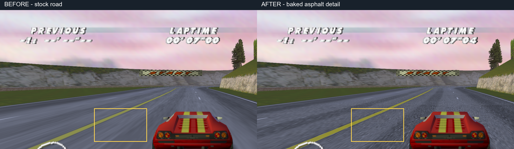
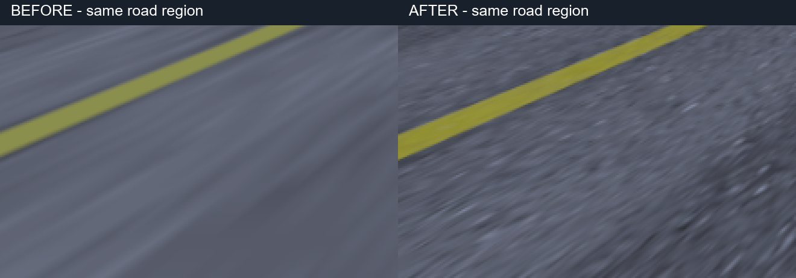

# Road detail comparison

The full-resolution originals are [before.png](before.png) and [after.png](after.png).
They are lossless PNG conversions of real window captures, not generated game
images. The comparison adds labels and yellow rectangles; the enlargement crops
the same 220x140 region at (390,410) from each original and scales it 3x without
sharpening. Look for aggregate and small dark pits replacing the smooth streaks
in the foreground asphalt. The lane markings retain their atlas locations.

Both runs use circuit 1, car 0, one player, time-trial mode, the same default
graphics settings and 600 neutral replay frames. The vehicle is stationary so
camera framing matches. HUD clock values differ slightly because window captures
are wall-clock samples. This is baked color detail, not per-pixel normal lighting.

Local source artifacts (2026-09-09):

- Before: `artifacts/road-captures/pr-before-8n5fxak7/frame-012.bmp`, no pack.
- After: `artifacts/road-captures/pr-after-1e5g11z1/frame-012.bmp`, corrected road pack.
- Moving replay: `artifacts/road-captures/driving-pilot-baayvri1/runner-result.json`:
  circuit 1, state 8, 601 swaps, 600/600 inputs consumed and verified, peak speed 175.
- The pack is BC7 at 768x96 with ten mip levels, streaming and a low-mip cache.
- `build.ps1` passed, as did the headless race smoke and four targeted CTests.

These screenshots demonstrate the surface appearance; they do not establish
shimmer-free motion or Intel HD 620 performance. The test GPU was an RTX 3080.
